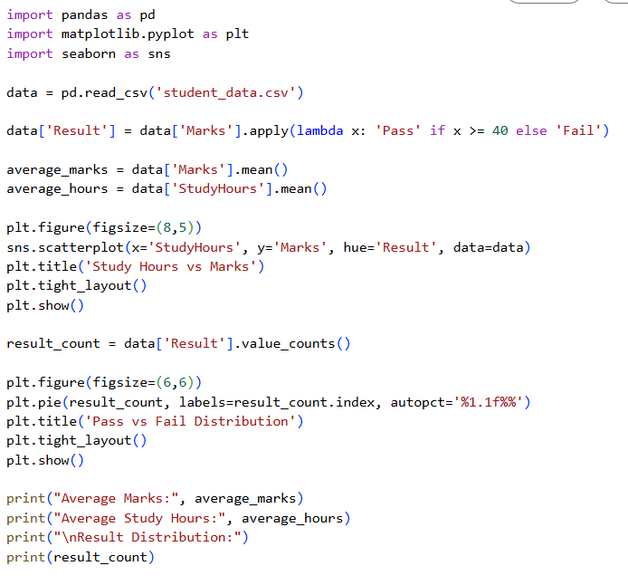
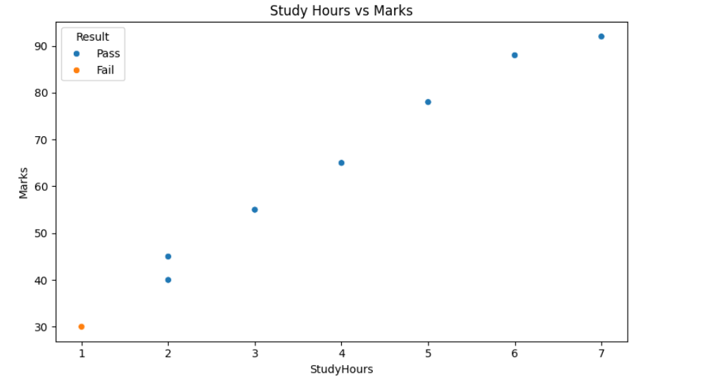
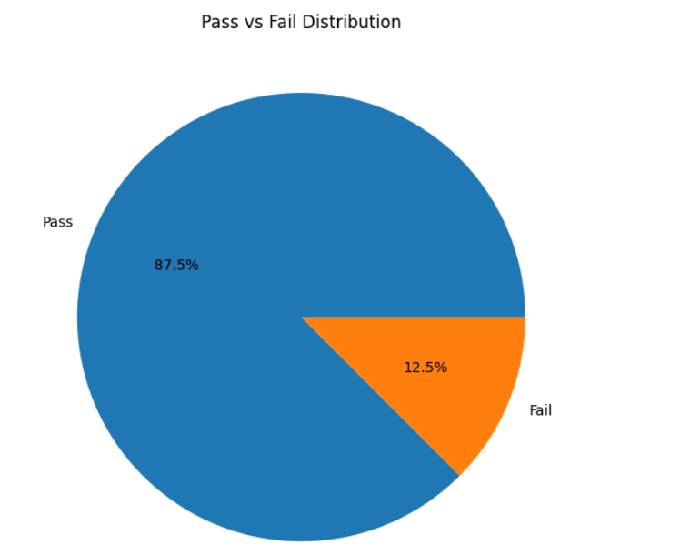

# student-performance-analysis
This project analyzes student academic performance data to identify trends between study habits and exam results. Using Python and data analysis libraries, the project processes and visualizes educational data to generate meaningful insights. A simple rule-based method is used to classify students as Pass or Fail based on their marks
# Student Performance Analysis

This project analyzes student academic performance using Python. The goal is to understand how study hours and attendance affect marks and to identify pass/fail outcomes.

## Objective
- Analyze student marks
- Study relationship between study hours and performance
- Identify pass/fail distribution
- Visualize trends for academic insights

## Dataset
The dataset contains:
- StudentID
- Name
- StudyHours
- Attendance
- Marks

## Features
- Average marks and study hours calculation
- Pass/Fail classification
- Scatter plot of study hours vs marks
- Pie chart of pass vs fail distribution

## Technologies Used
- Python
- Pandas
- Matplotlib
- Seaborn

## Screenshots

### body of code

### Study Hours vs Marks

### Pass vs Fail Distribution

### Pass vs Fail Distribution

## How to Run
Upload the files to Google Colab and run the Python script to generate analysis and visualizations.
